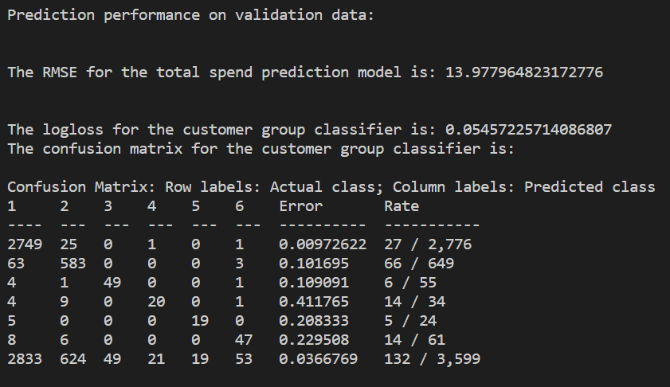

# Machine Learning Pipeline
A Machine Learning Pipeline for Predicting **total spend** and **customer groups** of tourists from a set of survey data using [H20 AI's GBM](https://docs.h2o.ai/h2o/latest-stable/h2o-docs/data-science/gbm.html). This is part of a Data Science assignment for a job interview. 

## Installation
Firstly, clone the repository to a folder of your choice. 

Next install Anaconda's distribution of Python and install the necessary libraries:

1. Create an environment with a specific version of Python and activate the environment
	```
   conda create -n <env name> python=3.7.6
   ```

2. Activate your conda environment
	```
   conda activate <env name>
   ```

3. Install libraries in requirements.txt file. For Windows machine, run the following code in the command line. 
   ```
   for /f %i in (requirements.txt) do conda install --yes %i
   ```

The input dataset has been ignored in this repo for confidentiality reasons. 

With the input dataset available, run the following file:

```
python src\train.py
```

This would run the machine learning pipeline, that processes the input data and generates predictions for both **total spend** and **customer groups**. The results of the model is as follows:


